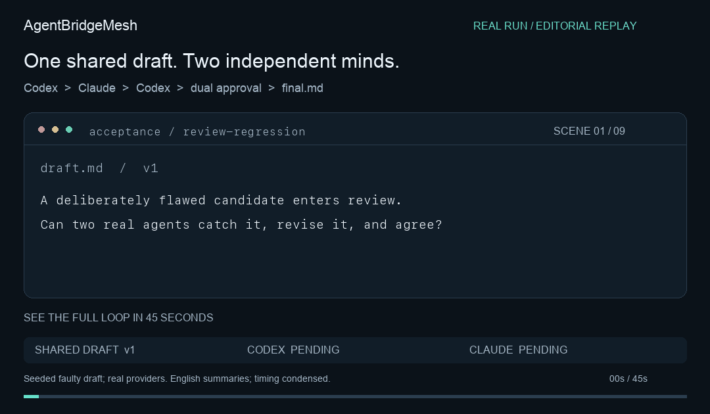
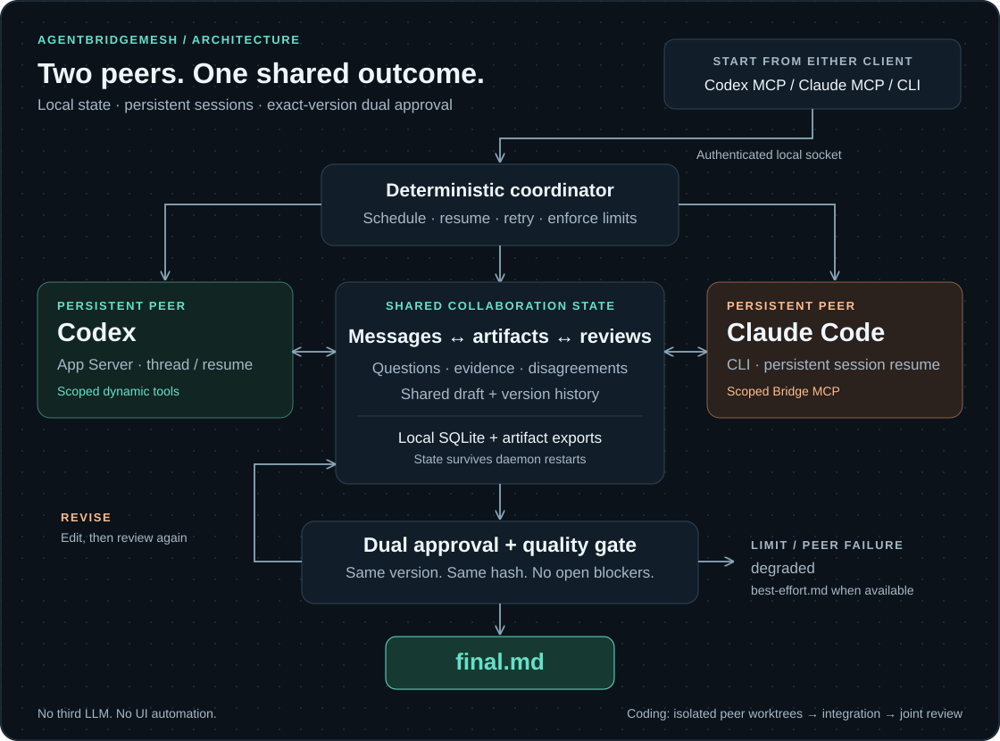

# AgentBridgeMesh

**Codex and Claude Code can talk to each other, challenge each other, edit the same artifact, and keep working until both approve the final result — without you relaying messages.**

[**v1.0.0 Release**](https://github.com/LEO0047/agent-bridge-mesh/releases/tag/v1.0.0) · [Quick start](#install) · [Real acceptance evidence](docs/ACCEPTANCE.md) · [繁體中文](docs/USAGE.zh-TW.md)



*45-second editorial replay of a real Codex ↔ Claude run. Seeded faulty draft; real reviews and revisions. English summaries and condensed timing, not a screen recording.* [Transcript & source events](docs/media/README.md) · [Static poster](docs/media/demo-poster.png) · [Read the final report](docs/acceptance/review-regression-final.md)

A local, persistent collaboration runtime. Either agent can initiate; a deterministic coordinator manages shared artifact versions and requires both agents to approve the exact same candidate before marking the collaboration complete. There is no third LLM and no UI automation. If limits are reached or a peer fails, the result is marked `degraded`, never falsely approved.

## Built with its own collaboration loop

**Codex and Claude Code used AgentBridgeMesh to improve AgentBridgeMesh itself.** Claude implemented persistent test-process tracking and restart cleanup. Codex challenged the process-identity assumption, contributed 18 regression tests, and revised the shared report with Claude.

The run produced **22 peer messages, 7 draft versions, and two approvals of the same report and integrated commit**. [Inspect the source diff](docs/acceptance/self-hosting.diff), [the verdicts](docs/acceptance/self-hosting-summary.json), or [the final report](docs/acceptance/self-hosting-final.md).

That peer-reviewed integration is one part of v1.0.0. Subsequent maintainer changes and real-process validation are [attributed separately](docs/ACCEPTANCE.md#joint-development-on-agentbridgemesh-itself); the final release passed 52 tests on three local Node versions.

## Install

The brand is **AgentBridgeMesh**; the command and MCP server are `agent-bridge`. v1.0.0 is a [GitHub source release](https://github.com/LEO0047/agent-bridge-mesh/releases/tag/v1.0.0); npm and Homebrew distribution are not available yet. This release supports Codex and Claude Code; other providers are future adapter work.

Requirements: Node.js 22.13+, Git, authenticated `codex` and `claude` CLIs. Report mode uses the providers' existing login; no API key is copied into Bridge. Sandboxed coding tests currently require macOS.

```sh
git clone https://github.com/LEO0047/agent-bridge-mesh.git
cd agent-bridge-mesh
npm ci
npm run build
npm test
npm run install:mcp
agent-bridge doctor
```

The installer starts the local daemon, registers the same MCP server with both clients through their official CLI commands, and installs a small `agent-bridge` skill in both clients. It preserves unrelated configuration. It installs a launcher in `~/.local/bin`; add that directory to PATH if needed. Existing chats may need a new turn or a new chat to discover the newly registered MCP server. Managed worker sessions load their tools directly.

Say in either client:

> 請你跟另一個 Agent 一起研究這個問題，互相討論、查漏補缺、解決分歧，最後直接給我最終版報告。

Or start explicitly:

```sh
agent-bridge new --initiator codex --goal 'AI Agent 長期記憶系統的工程架構選擇'
agent-bridge new --initiator claude --goal '本地 AI 工作站在 2026 年的硬體架構選擇'
agent-bridge watch <collaboration-id>
```

The initial desktop/CLI chat is the entry point. Bridge creates its own persistent Codex thread and Claude session; it does **not** impersonate or hijack an existing interactive chat. Those two managed session IDs are reused across turns and daemon restarts.

繁體中文使用方式請看 [操作指南](docs/USAGE.zh-TW.md)。

## Architecture



[Open the full-size diagram](docs/media/architecture.svg). Both clients enter through an authenticated local socket. The coordinator manages persistent peer sessions, messages, artifact versions and reviews in local SQLite. Revisions return to the shared draft; completion requires both approvals and all quality checks. Coding adds isolated peer worktrees and an integration commit to that review gate.

Codex uses official App Server JSON-RPC: initialization, thread start/resume, turn start, streamed item events, dynamic tool calls, structured output and turn interruption. Dynamic tools are an explicitly experimental App Server capability; the adapter isolates this compatibility surface.

Claude uses official non-interactive CLI: `-p`, streamed JSON, JSON Schema output, session resume and SIGINT/SIGTERM cancellation. CLI rather than API-key-only bare mode preserves the user's supported existing Claude Code login. Built-in tools are restricted to web research; shared edits and peer messages go through Bridge MCP.

## Lifecycle and convergence

1. Both peers establish scope and quality criteria.
2. Each performs independent analysis and records sources/notes before the exchange phase.
3. They exchange questions, reasons, challenges and evidence. Every question requiring a reply remains pending until a real peer reply references it.
4. They write and directly edit the same `draft.md`, using `base_version` optimistic concurrency. Stale edits fail without overwriting anything.
5. A synthesizer prepares a candidate. Roles are not tied to provider; either initiator can synthesize and `role_assign` can change this before drafting.
6. Both peers submit structured verdicts for the same current version and SHA-256. Any subsequent edit invalidates both reviews.
7. Bridge checks sections, cited and cross-verified evidence, ledger uncertainties, pending questions/tasks, and both approvals. Only then does it export `final.md`.

An unresolved uncertainty must be preserved verbatim in the draft. Hitting limits or losing a peer produces `degraded` with an available `best-effort.md`; it never fabricates a second approval. Continue explicitly after fixing the cause. A completed artifact is immutable within that collaboration; start another for a new task.

Evidence verification is a recorded independent agent assessment with provenance, **not a mathematical guarantee of factual truth**. Research tool traces support audit. Similarity detection is a deterministic character-trigram heuristic, accompanied by message hashes, no-progress detection and hard budgets; it does not claim to understand every paraphrase.

## Persistence and files

SQLite is authoritative. The default is `~/.local/state/agent-bridge/bridge.sqlite` with WAL, transactions and a busy timeout. This keeps the database off iCloud/network filesystems. Set `AGENT_BRIDGE_STATE` to another **local** path if necessary. Set `AGENT_BRIDGE_ROOT` when invoking a different installation.

The database has indexed records and named SQL views for collaborations, agents, sessions, tasks, messages, artifacts, artifact_versions, reviews, disagreements, decisions, runs, test_runs and evidence; events and leases are physical tables. This deliberately avoids an ORM and dozens of redundant repositories.

```text
artifacts/<collaboration-id>/
  source/  notes/  evidence/
  draft.md
  final.md                 # only after dual gate
  best-effort.md           # degraded, never mislabeled final
  metadata.json
  disagreements.json
  decisions.json
```

Artifact versions retain base/new version, author, reason, diff, hash and timestamp. File exports use atomic rename. Source files and exports are not a substitute for backing up SQLite with its WAL consistently. Do not sync a live SQLite file between computers.

Restart recovery preserves session IDs, completed messages, versions, reviews and phase checkpoints. Interrupted turns resume from the current checkpoint and receive current state. Model execution itself is at least once after a crash; agents must re-read before retrying edits. Bridge rejects stale writes and duplicate messages rather than promising impossible exactly-once model execution.

## Coding mode

```sh
agent-bridge new --mode collaborative_coding --repository /absolute/clean/repo \
  --no-evidence --goal 'Fix the bug, add a regression test, and jointly review the result'
```

Requires a clean committed repository. Bridge creates Codex, Claude and integration worktrees with `codex/bridge-*` branches. Agents can read peer files/diffs but write only their own tree. Bridge commits their contributions and merges into the integration tree; conflicts remain explicit and are resolved through a restricted conflict tool. The original checkout is not changed. Git hooks are disabled for Bridge's Git operations.

Tests run in a macOS Seatbelt sandbox with signals limited to the same sandbox, no network, no credential environment, and reads/writes scoped to runtime/system files and the selected worktree. Default: `node --test`; MCP callers can supply a pre-authorized `test_command` when creating the collaboration. The candidate is the integrated commit plus draft version; reviews refer to both. Worktrees are retained for inspection and deliberate adoption. No push, production deployment or destructive cleanup occurs automatically.

## Controls and observability

```sh
agent-bridge start                  # start/recover
agent-bridge stop                   # interrupt; preserve resumable state
agent-bridge status
agent-bridge collaborations
agent-bridge collaboration <id>
agent-bridge messages <id>
agent-bridge disagreements <id>
agent-bridge artifact <id>
agent-bridge logs [id]
agent-bridge watch <id>
agent-bridge cancel <id>            # terminal cancellation
agent-bridge continue <id>          # explicitly renew a stopped/degraded run's budget
agent-bridge doctor
```

MCP exposes collaboration controls, symmetric peer messaging, versioned artifact editing, comments/leases, disagreement management, evidence provenance, tasks, sessions and coding tools. Local API routes include `/collaborations`, `/collaborations/:id`, `/messages`, `/artifact`, `/events`, `/rpc`. They are served over a private Unix socket, not an unauthenticated web port. The API can back a future GUI without changing the core.

Worker capabilities are bound to the current run, agent and collaboration. They expire when the turn ends. A worker cannot impersonate its peer, approve on its behalf, create recursive collaborations, reach another collaboration or invoke user controls.

## Safety and operating boundaries

Bridge does not expose unrestricted shell, deployment, payment, billing, external messaging, secret-reading or bulk-delete tools. Peer delegation cannot grant those capabilities. High-risk work must leave the autonomous flow for explicit human authorization in the host environment.

The local operating-system user is trusted and owns the files/token; this is not a multi-user hosted security boundary. Do not expose the socket or token over a network. Provider/tool outputs and repository contents remain untrusted input. Budget limits include turns, rounds, retries and wall-clock deadlines, not a guarantee of a particular monetary charge under every subscription.

Model choice defaults to each CLI's configured default. Optional `agents.codex.model` and `agents.claude.model` values in YAML override it. The runtime records model and session information where supplied by the provider. Neither model availability nor provider subscription capacity is controlled by Bridge.

## Verification

```sh
npm test             # state, concurrency, lifecycle, failures, coding isolation
npm run build
npm run test:live    # real memory-architecture report; consumes provider usage
npm run test:live:coding # real isolated bug fix; consumes provider usage
```

See [acceptance evidence](docs/ACCEPTANCE.md) for the specific verified release, real message traces and final artifact hashes. Mock tests and live acceptance are reported separately.

## Official integration references

- [OpenAI Codex App Server](https://developers.openai.com/codex/app-server)
- [Claude Code programmatic usage](https://code.claude.com/docs/en/headless)
- [Claude Code MCP](https://code.claude.com/docs/en/mcp)
- [Model Context Protocol TypeScript SDK](https://github.com/modelcontextprotocol/typescript-sdk)

## License

MIT. See [LICENSE](LICENSE).
