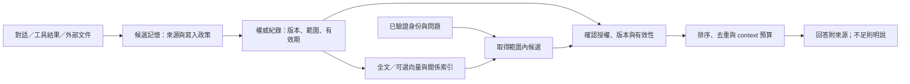

# AI Agent 長期記憶系統的工程架構選擇

**建議從一個可信、可更正的資料來源開始，再按實測需求增加檢索能力。** 個人系統通常先用檔案或 SQLite；團隊優先沿用既有資料庫與授權機制。向量、圖譜、事件重播各自解決不同問題，沒有必要一次全部部署。

本報告由兩位 Agent 獨立查閱一手資料、交叉核對並共同修訂。資料取用日期：2026-09-28。產品能力以連結文件為依據；架構推薦、驗收方法與升級條件是工程判斷，並非本次已完成的效能測試。

## 架構

### 先界定記憶的責任

長期記憶是跨工作階段仍能取用、修正與撤銷的資訊。使用者偏好、專案決策、查證過的事實與過往事件可以成為記憶；整份聊天紀錄不必自動升格為永久記憶。外部知識庫提供的是外部資訊，Agent 自己學到的偏好與決策仍需另外定義保存責任。

三層要分清：

| 層次 | 負責什麼 | 不能因此保證什麼 |
|---|---|---|
| 上下文管理 | 決定這次送給模型哪些內容、何時摘要或移除 | 不保證跨階段保存或可追溯 |
| 檢索與衍生資料 | 全文、向量、關係索引與摘要，協助找回資訊 | 相似度不等於事實正確或有權讀取 |
| 權威資料 | 系統採信的原始紀錄、人工更正、有效版本與來源 | 保存在資料庫不代表內容本身為真 |

這是**邏輯責任的區分，不要求三個服務**。來源與轉換方式足夠時，索引可重建；人工修訂若無其他留存副本，就應視為權威資料。生成式摘要即使保留模型版本，也未必能逐字重現。

平台工具也不等於代管記憶。例如 Anthropic memory tool 是由應用執行檔案操作的介面，可映射本機目錄或資料庫；context editing 則處理活躍對話內容，兩者責任不同。[Memory tool](https://platform.claude.com/docs/en/agents-and-tools/tool-use/memory-tool)、[Context editing](https://platform.claude.com/docs/en/build-with-claude/context-editing)。

### A. 檔案與 Git：適合人能直接維護的記憶

**用途與最小實作。** 少量偏好、專案說明與穩定流程，可用 Markdown／JSON 加目錄與文字搜尋。每條紀錄有穩定 ID、來源、日期及狀態；修改用單一寫入者或版本檢查，避免兩個 Agent 同時覆寫。Git 是可選的審查、差異與歷史工具；commit 能說明檔案怎麼變，不能證明記憶為真。

**代價與失效模式。** 文字容易閱讀，但大量條目的篩選、跨檔一致性與逐筆權限會變成應用程式的責任。編輯和刪除目前版本很容易，Git 歷史卻仍可保存舊內容；歷史清除須協調 clone、副本與託管端，舊 clone 還可能把資料重新帶回。不要預設把私密對話或常需撤回的資訊提交 Git。[Git 物件模型](https://git-scm.com/book/en/v2/Git-Internals-Git-Objects)、[GitHub 敏感資料清除](https://docs.github.com/en/authentication/keeping-your-account-and-data-secure/removing-sensitive-data-from-a-repository)。

**升級條件。** 當查詢需要多個欄位、修改需跨紀錄交易，或寫入衝突與搜尋掃描已造成實際問題，再加 SQLite。若檔案仍是權威來源，資料庫就只做可重建索引；不要讓檔案與資料庫各自成為可任意修改的主本。

### B. SQLite／全文索引：低元件數的通用起點

**用途與最小實作。** SQLite 主表保存內容、來源與版本，普通索引處理 ID、範圍、時間，FTS5 處理詞彙查詢及 BM25 排序。external-content FTS 的一致性須由應用或 triggers 維護，既有內容須初始化／重建索引；不要只測主表查得到就宣稱全文檢索正常。[FTS5](https://www.sqlite.org/fts5.html)。

**中文是要驗證的弱點。** 內建 tokenizer 為 unicode61、ascii、porter、trigram；沒有現成中文語意斷詞保證。trigram 支援子字串，但少於三個 Unicode 字元的 MATCH 不命中。官方有自訂 tokenizer API，仍需自行整合與維護。建議以兩字詞、人名、型號與別名測試；小語料可用範圍受限的子字串掃描補短詞，之後才比較預分詞或向量。未有繁中基準前，不保證其排序品質或索引大小優於其他方案。[FTS5 tokenizer](https://www.sqlite.org/fts5.html#tokenizers)。

**並行與備份。** WAL 允許讀寫並行，但一次只有一個 writer，且不支援跨機器網路檔案系統上的 WAL。單機應用伺服器透過 API 服務團隊仍可適用；多台電腦直接共享資料庫檔是另一種情境。備份使用一致性備份機制並測試還原，不把同步運作中的檔案當作完整策略。[WAL](https://www.sqlite.org/wal.html)、[適用情境](https://www.sqlite.org/whentouse.html)、[Backup API](https://www.sqlite.org/backup.html)。

**升級條件。** 持續寫入排隊超出延遲目標、需要多實例寫入或更完整的高可用與權限治理時，考慮 PostgreSQL 等用戶端／伺服器資料庫。團隊人數與資料筆數本身不是充分理由。

### C. 事件紀錄：區分稽核與完整事件溯源

**用途與最小實作。** 「目前狀態表＋必要的變更紀錄」足以保存誰因何修改記憶。完整 event sourcing 則以事件作權威來源，重播形成狀態，通常另有讀取投影與快照；這比加一張 audit 表承擔更多責任。微軟官方明確提醒其遷移與設計成本，多數系統仍可使用一般 CRUD。[Event Sourcing](https://learn.microsoft.com/en-us/azure/architecture/patterns/event-sourcing)。

**代價與失效模式。** 寫入要處理事件順序、版本與重複投遞；讀取要維護投影或付重播成本。補償事件可以更正狀態，不能消除舊事件中的私密內容。個資宜外置、事件只引用 ID；無法外置時，才評估具備金鑰治理的 crypto-shredding。這也需要處理金鑰副本與明文衍生物，不能等同所有媒體已抹除。[事件與個資處理](https://learn.microsoft.com/en-us/azure/architecture/patterns/event-sourcing)。

**採用門檻。** 確實需要還原「某時點系統知道什麼」、重算多種歷史投影，且能維護事件版本、重播與刪除配套時才值得。多寫入者、一般稽核或單純重建全文索引，不足以要求全面 event sourcing。記錄「事實何時有效」及「系統何時得知」也可先用一般資料表實作。

### D. 向量資料庫：增加語意召回，仍要保留精確查詢

**用途與最小實作。** 向量適合測試改寫、低詞彙重疊與跨語言查詢的召回增益，效果取決於嵌入模型與語料。向量搜尋可以精確計算，也可用近似最近鄰索引（ANN）換取速度；pgvector 說明未建索引時預設執行精確最近鄰搜尋並提供完整召回，建索引則是以召回換速度。**因此資料量小或延遲可接受時，可以只加向量欄位而完全不建 ANN 索引，下述近似索引的召回與過濾問題就不會發生。** 先在既有資料庫加入向量欄位，視實測延遲再決定是否需要 ANN。[pgvector](https://github.com/pgvector/pgvector)。

**失效模式。** 語意相似不保證事實相同；ANN 又額外引入召回損失。pgvector 的 ANN 掃描後再套條件，可能少回結果；iterative scans、partial index 或分區能緩解，但仍須測量。共用 ANN 會讓租戶互相影響召回與速度，強隔離可採獨立表或分區。這與授權是否正確是兩個問題。[Filtering 與 Multitenancy](https://github.com/pgvector/pgvector#filtering)。

專用服務有不同取捨。例如 Qdrant 的 filterable HNSW 用額外圖邊改善過濾搜尋，官方強烈建議灌資料前建立相關 payload indexes；不能因此推論所有嚴格條件都不損召回。[Qdrant Indexing](https://qdrant.tech/documentation/manage-data/indexing/)。

**寫入、更新與刪除。** 切塊、嵌入與模型遷移都增加成本；每個 chunk 必須指回來源版本。條件更新也有產品細節：依 Qdrant 文件，對不存在的 point 做條件更新時，預設行為等同一般 upsert，會忽略過濾條件直接插入；只更新既有點必須明確指定 `update_mode=update_only`。背景重算與重試仍需刪除標記，防止記憶復活。[Qdrant Points](https://qdrant.tech/documentation/manage-data/points/)。

**主庫選擇。** 專用向量庫可以保存原文 payload，本報告不否定它作主庫的能力；若承擔此角色，仍須驗證版本條件、授權、刪除及復原。預設建議沿用既有權威庫，將向量當衍生資料。外部文件系統若已保存完整權威資料，也可只建可重建的向量服務。精確 ID、稽核與列舉查詢須有結構化路徑。

**升級條件。** 用測試集證明詞彙檢索漏掉重要改寫，再加語意檢索；只有現有資料庫在召回、延遲、過濾或運維上確有不足，才評估獨立向量服務。

### E. 知識圖譜：關係本身是產品需求時才值得

**用途。** 圖譜便於表達有方向、時間與來源的關係，例如「某決定依據哪份文件、影響哪些專案」。互相矛盾的主張也可並存，但需要額外規則判定衝突；圖資料庫不會自動完成查證。

RDF named graph 提供主張分組的位置；規格沒有自動賦予 graph name 來源含義，時間與權限也須另行建模。屬性圖可把來源放在節點或邊上。兩者都不免除實體辨識與治理成本。[W3C RDF 1.1](https://www.w3.org/TR/rdf11-concepts/#section-dataset)。

**圖庫也可能自帶檢索索引。** 例如 Neo4j 文件把向量索引定位為近似最近鄰查詢，明說回傳的 k 個鄰居不保證是真正最近的，並列出維度上限與「同一標籤屬性只能有一個向量索引」等限制，官方也建議與全文檢索等排名來源組成混合檢索。因此「已有圖庫就順便做語意檢索」是可行選項，但取捨與 D 節相同：仍要自行量測過濾條件下的召回，不能因為少部署一個服務就假設檢索品質沒有代價。[Neo4j 向量索引](https://neo4j.com/docs/cypher-manual/current/indexes/semantic-indexes/vector-indexes/)。

**最小實作與代價。** 先用既有資料庫的 entities／edges 表，為邊保留關係類型、來源、有效期間與狀態。寫入成本在抽取、別名合併與校正；查詢還要限制遍歷範圍、路徑權限與時間。更正關係或刪除來源時，須處理相關邊與衍生結論，不能看到孤立節點就任意刪掉其他來源支持的實體。人工校正應獨立保存。

**升級條件。** 有穩定的實體與關係模型，且實際多跳查詢、路徑解釋或效能已讓 SQL 實作難以維護時，再用圖庫。單純要保存互斥事實或兩三層關係，不足以強制換庫；反之，跳數少也不是圖庫永遠不適用的證明。

### F. 混合設計：先在一個資料庫內完成

推薦的最小邏輯流程如下；各方塊可在同一個程式與資料庫內：

索引先回候選 ID，再從權威資料取出目前有權讀取的版本，可降低索引延遲造成的風險；權限控制也須涵蓋搜尋服務本身。全文與向量混合可按排名合併、去重後重排，不直接相加量尺不同的分數；是否重排應以收益與延遲決定。

原文與已算好的向量可同交易提交；若背景計算嵌入，即使同一資料庫仍需版本條件與待處理狀態。**不要在等待模型呼叫時長時間持有資料庫寫鎖。** 若跨庫同步，主資料與 outbox 同交易寫入，再由可重試、冪等的 worker 更新投影；另記錄進度、重試失敗與版本落後量。這能處理雙寫部分成功，不能把跨庫變成即時原子交易。[AWS Transactional Outbox](https://docs.aws.amazon.com/prescriptive-guidance/latest/cloud-design-patterns/transactional-outbox.html)。

不必要的混合包括：既有庫足夠卻再加向量服務、同一稽核需求同時採 Git 與完整事件重播、沒有具體關係查詢卻建圖庫。判準是需求與測量，不是元件數量。

### G. 所有方案都要完成的記憶生命週期

以下是工程建議，應按資料敏感度與使用目的裁剪。

**寫入與來源。** 先抽取候選，再判斷是否值得長期保存；暫時任務結果可設定期限。區分使用者明示、工具觀察、外部主張與模型推論，不能把模型自評信心當成正確機率。對話與文件中的指令是待處理資料，不能藉記憶提升為高權限操作規則；能讀不代表能改寫。

最小紀錄可包含：

| 欄位群組 | 目的 |
|---|---|
| `memory_id, scope/owner, status, revision` | 識別、隔離、撤銷與並行更新 |
| 內容、類型、`source_id, source_revision`、原文定位 | 區分主張與推論，能回查根據 |
| `observed_at, valid_from/valid_to, expires_at` | 分開得知時間、事實有效期與保存期限；未知留空 |
| `derived_from`、轉換版本 | 找回受更正／刪除影響的摘要、chunk 與圖譜邊 |

來源定位可指向訊息 ID、文件版本與段落；hash 協助辨別版本，不證明真實性。去重鍵也要包含範圍，避免把不同人的相同文字合併為共用私人記憶。

**更新與檢索。** 用 revision 比較避免舊寫入覆蓋新內容；區分新狀態與否證舊主張，例如「今年搬家」不代表去年的地址紀錄錯誤。重要衝突保留雙方來源，不只取最後寫入。檢索採有限 context 預算，剔除過期與重複內容，保留證據與矛盾標記；找不到足夠證據時可以拒答或重新查證，不能為湊滿 top-k 補入無關記憶。

**權限與撤權。** 身份與 tenant scope 由可信服務決定，不能信任模型自行提交的租戶 ID。權限要在正文進入 reranker／LLM／外部處理者前完成；嵌入與摘要生成也受資料外送政策約束。向量與摘要仍按來源的敏感度管理，不能視為匿名資料。

PostgreSQL RLS 能強制行級政策，但 superuser、BYPASSRLS 與通常的 table owner 可繞過；需測試真實應用角色，必要時對 owner 使用 FORCE RLS。參照完整性檢查也可能形成資訊洩漏面，不能只測 SELECT。[PostgreSQL RLS](https://www.postgresql.org/docs/current/ddl-rowsecurity.html)。若以 HTTP 提供記憶服務並採用 MCP 2025-06-18 的授權機制，伺服器須驗證權杖確實是發給自己的、拒絕其他權杖，也不得把用戶端權杖轉發給上游 API。該流程不適用於 STDIO；無論傳輸方式，仍須實作記憶條目的業務授權。[MCP 授權](https://modelcontextprotocol.io/specification/2025-06-18/basic/authorization)。

多來源摘要預設只能讓同時有權讀取相關來源的人看到，或拆成不同權限版本。撤權時應立即阻止受限內容及其摘要被取用，並使快取失效；無法確認權限的條目先不提供。仍有其他合法讀者時，撤權不必等同刪除整筆原始紀錄。

**刪除分兩層驗收。**

1. **停止使用／不再可見：** 權威層先撤銷，沿 `derived_from` 找出摘要、嵌入、索引、圖譜與快取，先阻止取用，再刪除或重建。用 ID、全文、向量、摘要查詢及重試任務確認不會復活。
2. **資料與副本清除：** 另追蹤資料檔、索引段落、日誌、匯出、受控副本、版本歷史與備份。訂出清除程序、責任人及期限；查無結果或 API 成功不證明媒體層完成。

SQLite 的 secure_delete 對虛擬表痕跡有明確限制，不能當作整體抹除保證。[SQLite secure_delete](https://www.sqlite.org/pragma.html#pragma_secure_delete)。保留最小刪除帳本／tombstone，讓背景工作與備份還原後先重套撤銷，避免舊資料重新進入服務。已送往外部系統的副本，須按該系統的保留與刪除能力處理，不能承諾本地刪除即可全部收回。

備份延後清除必須明示期限與禁止使用措施。ICO 在 UK GDPR 適用、有效刪除請求且無豁免的情況下，也要求處理備份；無法立即覆寫時應將資料置於不可再使用的狀態。這是特定法域的一手治理案例，不是所有個人系統的通用法律結論。[ICO Right to erasure](https://ico.org.uk/for-organisations/uk-gdpr-guidance-and-resources/individual-rights/individual-rights/right-to-erasure/)。

## 取捨

### 選擇的是負擔得起的能力組合

| 方案 | 最適合的需求 | 主要維護負擔 | 不應因此直接升級 |
|---|---|---|---|
| 檔案＋可選 Git | 人編偏好、流程、少量決策 | 寫入衝突、跨檔查詢、歷史清除 | 只是檔案變多 |
| SQLite＋全文 | 結構化篩選、精確詞彙、單機交易 | 中文分詞、索引同步、備份與寫入排隊 | 只是開始有團隊使用 |
| 向量 | 改寫與低詞彙重疊的召回 | 嵌入、過濾下召回、版本遷移 | 只因產品叫 Agent |
| 圖譜 | 關係、路徑與主張來源治理 | 實體解析、關係模型、遍歷授權 | 只因資料有實體名稱 |
| 事件溯源 | 歷史重建、多種事件投影 | 重播、事件版本、投影與刪除 | 只要記錄誰改過 |
| 混合 | 已證明單一檢索不足 | 同步、失效、重建與故障處理 | 只因可以接更多資料庫 |

### 評估：分開量「近似誤差」與「是否真的幫助工作」

先整理一小組人工核對過的真實問題與應命中記憶 ID，例如 30–100 題作起步，這是建議規模，不代表統計充分。涵蓋中文短詞、精確代碼、改寫、跨語言、矛盾、過期、撤權、刪除及惡意誘導寫入。

- **檢索品質：** 以人工標註量 recall@k、precision@k 與來源支持率。另在相同向量、距離與過濾條件下，以精確搜尋對照 ANN，量近似索引遺失多少鄰居；精確鄰居不等於語意相關答案。
- **記憶品質：** 量錯誤寫入、重複、過期使用、衝突漏判，以及來源已失效卻仍被摘要沿用的比例。模型評審須用人工樣本校準。
- **實際任務：** 在相同生成模型、語料與 context 預算下比較無記憶、全文、向量、混合；量任務成功、錯誤行動、p95 延遲與每成功任務成本。按時間切分資料，不能讓未來資訊流入過去問題。
- **操作驗收：** 模擬跨租戶讀寫、撤權後快取、刪除後重試、部分同步失敗與備份還原。記錄停止可見及副本清除的耗時，授權測試和召回測試不能互相替代。

上線前先定可接受的延遲、恢復時間（RTO）、可容忍資料損失（RPO）與刪除期限。新增索引只有在任務收益成立、權限與刪除測試仍過關、且維護成本可承受時才保留；模型、切塊策略或資料分布改變後再評估。

### 成本：把模型使用與維護人力一起算

估算期間總成本可寫成：

**固定服務＋資料／索引／備份儲存＋寫入抽取與嵌入＋查詢嵌入／重排／生成 context＋重建遷移＋維運修復人時。**

向量成本受切塊數、重疊、維度、索引及副本數影響；模型更換時，仍要用新模型檢索的語料需重新嵌入，可分批或新舊版本並行。不同模型的向量不要直接混在同一距離空間。圖譜另有抽取與人工校正；事件溯源另有歷史、快照與重播成本；檔案和 SQLite 的服務負擔較低，但備份、權限與修復並非免費。

少存無用內容、減少重複抽取、限制 context，往往比新增檢索服務更值得先試。實際主成本須由用量與工時計算，不能一律斷言是資料庫或人力。Context editing 可能令快取前綴失效而產生重建快取費用，也是需量測的機制。[Context editing 與 caching](https://platform.claude.com/docs/en/build-with-claude/context-editing)。

本次沒有工作負載實測、雲端報價或繁中索引品質基準，故不提供月費、吞吐與資料筆數的通用換庫門檻。Qdrant points 單頁亦不足以確定實體清除時程，採購或部署前須按版本、拓撲與保留政策核對；這不表示產品無該能力。

## 建議

### 小型個人系統

**只要記住少量穩定偏好：先用 Markdown／JSON 與文字搜尋。** 限制寫入位置，保留來源與日期；需要 diff 審查時才加 Git，敏感內容依刪除需求另存。

**需要持續自動寫入、篩選與更正：選一個本機程式＋SQLite 主表＋FTS5。** 人工維護的流程檔可並存，但指定各自管理什麼，不產生兩個主本。備份採一致性快照、設保留期限並至少驗證一次還原；活躍資料庫不放進多人直接共享的同步資料夾。

先讓記憶可列出、編輯、停用與刪除，再改善搜尋。中文先測短詞與別名；詞彙召回不足才試語意檢索，先評估同程序／既有資料庫中的方案。圖關係先用表；只為重建索引，不需要完整事件溯源。

### 團隊系統

**優先使用團隊已能穩定維護的資料庫。** 已有 PostgreSQL，先共用其交易、備份與身份治理，必要時加全文與 pgvector；已有圖庫且關係模型成熟，也可評估其中的檢索能力，不為形式統一強迫搬家。

小團隊、單一應用實例、寫入可排隊且可用性要求有限時，SQLite behind API 仍可行。出現持續寫入競爭、多實例部署、高可用或隔離要求，才按測量遷移；不讓多台機器直接共用 SQLite 檔。

團隊最少要有：

1. **可追責的授權：** 分開個人、專案與組織範圍，查詢、寫入、匯出、背景處理都驗證身份；撤權同步到衍生物與快取。
2. **可運作的更新與刪除：** 版本條件、衍生關聯、刪除標記與備份還原流程。跨庫才加入可靠同步工作，監控投影落後與失敗。
3. **可比較的品質與成本：** 有真實問句集、錯誤記憶回報入口、延遲與成本指標，並有人負責修正記憶。

遷移時先保留穩定 ID、來源與刪除狀態，建立新投影並影子查詢比對；驗證後再切換，保留能回退的舊讀取路徑，直到新方案符合既定品質與恢復目標。**一個能找到正確來源、接受更正並確實撤銷資訊的簡單系統，比無法解釋或刪除的多庫系統更值得採用。**

## 來源

以下皆為本次實際開啟的一手資料，統一取用日期為 **2026-09-28**。主張旁已附直接連結，此表便於回查支持範圍；官方文件說明能力，不代表本報告已實測產品或驗證所有部署版本。

| 一手來源 | 支持範圍 |
|---|---|
| [Git Internals：Git Objects](https://git-scm.com/book/en/v2/Git-Internals-Git-Objects) | 內容物件與版本保留 |
| [GitHub：移除敏感資料](https://docs.github.com/en/authentication/keeping-your-account-and-data-secure/removing-sensitive-data-from-a-repository) | 歷史改寫、clone 協調與再次引入風險 |
| [SQLite FTS5](https://www.sqlite.org/fts5.html) | 全文索引、tokenizer、短字串限制及同步責任 |
| [SQLite WAL](https://www.sqlite.org/wal.html)／[適用情境](https://www.sqlite.org/whentouse.html) | 單一 writer、同機需求及 API 伺服器情境 |
| [SQLite Backup](https://www.sqlite.org/backup.html)／[secure_delete](https://www.sqlite.org/pragma.html#pragma_secure_delete) | 一致性備份與刪除痕跡限制 |
| [Azure：Event Sourcing](https://learn.microsoft.com/en-us/azure/architecture/patterns/event-sourcing) | 重播、複雜度、事件版本與個資外置 |
| [AWS：Transactional Outbox](https://docs.aws.amazon.com/prescriptive-guidance/latest/cloud-design-patterns/transactional-outbox.html) | 雙寫部分成功、同交易 outbox 及冪等消費 |
| [pgvector README](https://github.com/pgvector/pgvector) | 精確／近似搜尋、過濾、迭代掃描與多租戶影響 |
| [Qdrant Indexing](https://qdrant.tech/documentation/manage-data/indexing/)／[Points](https://qdrant.tech/documentation/manage-data/points/) | 過濾索引及條件更新／刪除行為 |
| [W3C RDF 1.1 Concepts](https://www.w3.org/TR/rdf11-concepts/) | 圖、named graph 的結構與語意邊界 |
| [Neo4j 向量索引](https://neo4j.com/docs/cypher-manual/current/indexes/semantic-indexes/vector-indexes/) | 圖庫內建向量索引為近似最近鄰、索引限制與混合檢索定位 |
| [PostgreSQL Row Security](https://www.postgresql.org/docs/current/ddl-rowsecurity.html) | 行級授權、角色繞過與完整性檢查限制 |
| [MCP 授權規格（2025-06-18）](https://modelcontextprotocol.io/specification/2025-06-18/basic/authorization) | 傳輸層的 token audience 驗證與禁止轉送他人 token |
| [Anthropic Memory tool](https://platform.claude.com/docs/en/agents-and-tools/tool-use/memory-tool)／[Context editing](https://platform.claude.com/docs/en/build-with-claude/context-editing) | 應用端記憶介面、上下文管理與快取成本 |
| [ICO：Right to erasure](https://ico.org.uk/for-organisations/uk-gdpr-guidance-and-resources/individual-rights/individual-rights/right-to-erasure/) | UK GDPR 適用條件下的備份刪除治理 |

法律部分僅使用 ICO 監理指引；EUR-Lex 條文頁本次未成功取得，未引用其原文。產品間品質優劣、繁體中文檢索效果、物理清除時程與實際成本，仍需針對部署與工作負載驗證。
